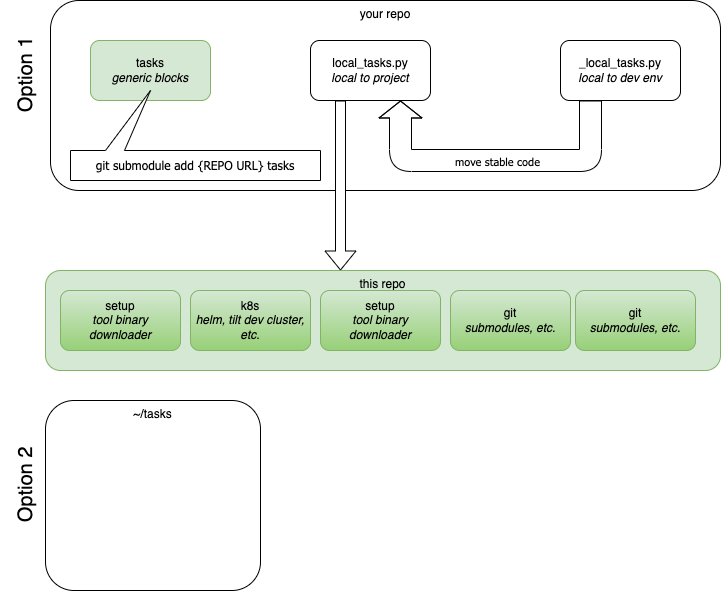

# Pyinvoke Automation Scripts

## TL;DR

1. Clone or submodule this repo as `tasks/`
2. Install Python invoke package globally to provide the command `inv`.

   To install [`inv`](https://pyinvoke.org) globally in OSX:
   `brew install pyinvoke`

   To install in Linux (with pipx)
   `pipx install invoke`

   To install _cross platform_, or if the above fails:

   `pip install --user invoke`



## Description

This repository holds a set of automation scripts for
some common tasks like binary downloading (specially for Kubernetes), shell setup (for VMs or SSH hosts),
docker image handling, local kubernetes development, git aliases
for now, but the list may expand.

A list of tasks can be shown with the command `inv -l`.


<small>This recording was done with `termtosvg`</small>

## Usage

Invoke is very similar to `make` in the chain-ability of targets (which are called
tasks).

## Autocompletion

To enable auto-completion, follow these instructions according to your shell (run `echo $SHELL` to find out which one you're using).
Make sure to restart the shell after the changes.

#### Bash

`inv --print-completion-script bash >> ~/.bashrc`

#### Zsh

`inv --print-completion-script zsh >> ~/.zshrc`

#### Fish

`inv --print-completion-script fish > ~/.config/fish/completions/inv.fish`

## Setup

This repo should be _sub-moduled_ at the top of the repo and the
`invoke` command should be available system-wide, although installing
it in the repo where sub-moduled should be fine.

### Debugging

If `breakpoint()` is not enough, we encourage to
add the `hunter` python library to trace/debug to your `invoke`
python environment to trace execution. It can be activated
with the PYTHONHUNTER environment variable.

```
PYTHONHUNTER='module="tasks"' inv -l
```

Visualizing variables:

```bash
PYTHONHUNTER='module__contains="my_file", actions=[CodePrinter, VarsSnooper]' inv -l
```

Debugging import issues with `local_tasks.py` in your repo:

```bash
 PYTHONHUNTER='module__contains="_discovery", actions=[CodePrinter, VarsSnooper]' inv -l
```

## Environment Variables

Some of this variables can be set in .envrc files [direnv](https://direnv.net) or
`.env` (note that this task will not auto-load the later and need to be sourced first)

## `TASKS_KEEP_MODULE_NAME_PREFIX`

Keeps the file name (module) as a prefix. When using `local_tasks` enables
`inv -l local_tasks`.

```
inv -l local-tasks
Available 'local-tasks' tasks:

  .create-local-dev-cluster                          Creates a local development cluster
  .deploy-demo-inference-service                     Deploys the demo inference service
  .send-http-inference                               More interesting stuff
```

## Self Tests

There's some self-tests bundled in the project. As of now, the binary downloader part of the [setup.py](setup.py) task modules
is the only part tested.

These can be triggered from:

```bash
docker compose -f _tests/compose.yaml run --rm test
```

### Testing with docker multi-platform support

On ARM Macs, run:

```bash
PLATFORM=linux/amd64 docker compose -f _tests/compose.yaml run --rm test inv install-k9s
```

Note that Docker can hold only a tag per platform, if you see a error message like
`Error response from daemon: conflict: unable to remove repository reference "python:3.11" (must force) - container 6a363e1c1b6c is using its referenced image ee16e609eb10`, run the following command to clear the tag:

```bash
docker image rm -f python:3.11
```

### Cross platform testing with buildx

```bash
docker build --platform linux/amd64  -t inv . && docker run --platform linux/amd64 -v .:/tasks --rm -ti  inv inv install-all
```
